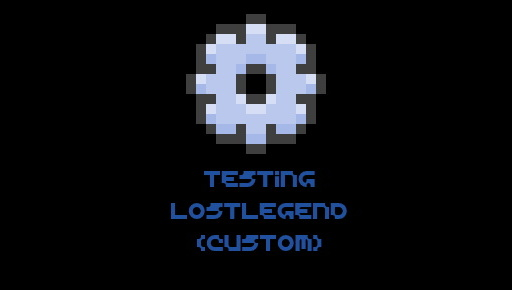

# Legends Minimal Mod Template
*provides a "bare minimum" (or at least what I think is bare minimum) of setup for Legends to load a world with **your** user-defined gamemode*

## Where do I put these files? 
Unlike Bedrock, Legends is currently extremely creator-unfriendly. It doesn't seem to respect development packs & such. You'll
have to place the BP and RP in their respective subdirectories under `premium_cache`. This is a multi-step process  for steam. WinStore may also work:
- place the files under `%APPDATA%\Minecraft Legends\internalStorage\premium_cache`
- add the pack UUIDs to `%APPDATA%\Minecraft Legends\<some numbers here for Steam>\games\com.mojang\minecraftpe\valid_known_packs.json`

## What do I have to change to redistribute this?
There are two things you should worry about:
- pack UUIDs
- the gamemode id.

The gamemode ID is a bit less of a problem. It should be a simple find-and-replace from `mod_template` to whatever your choice is.

Pack UUIDs obviously should be re-randomized, but they also need to be updated in `RP/gamelayer/launcher/game_mode.json`, or legends **will softlock**. 

You may also wish to update the icons in `RP/dlc_data`.

## What kinds of things can I do?
Legends has a bunch of different configurable subsystems (`gamelayer`), services (`services`), scripting (`scripts_bsharp20`), and such. 
It will be a while until docs exist. Until then, explore vanilla! It should give you a good sense of what you can accomplish.

### Note on world generation
This template is configured to use a `"flat"` world generator, since that allows for the use of a world template (place a world folder under `BP/world_template`). If you want a normal Legends world, removing that line in `RP/game_rules/gamerules.json` should be sufficient.
